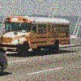

# recaptcha-dataset
This repository contains a multi-label classification dataset of reCAPTCHA images from the image selection task and is 
designed for nonprofit, educational, research and analysis purposes in image recognition, machine learning and similar 
fields.

## Dataset Structure
- Number of images: 29.568
- Size of each image: 100 x 100 px
- Labels: bicycle, bus, car, crosswalk, hydrant

| label   | bicycle                             | bus                     | car                     | crosswalk                                 | hydrant                             |
|---------|-------------------------------------|-------------------------|-------------------------|-------------------------------------------|-------------------------------------|
| example |  |  |  |  |  |

Here is a brief overview of the repository structure:
- `$LABEL/`: This directory contains reCAPTCHA images that have the label `$LABEL`, but can also have additional labels.
- `labels.csv`: This file provides the path and labels of each image.

## Contributing

We welcome any contribution to this dataset.
If you have additional images to add or find any errors, please open an issue or submit a pull request.

## License

This repository is released under the [MIT License](LICENSE). 

Please note that while this project is distributed under an open-source license, the reCAPTCHA images themselves are 
owned by Google.
[Fair Use](https://support.google.com/legal/answer/4558992?hl=en) from Google allows to use this dataset for nonprofit, educational, 
research and analysis purposes.